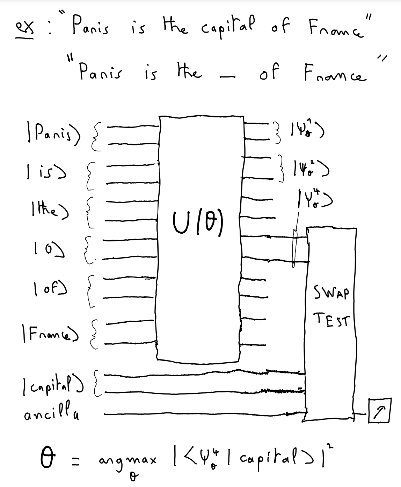
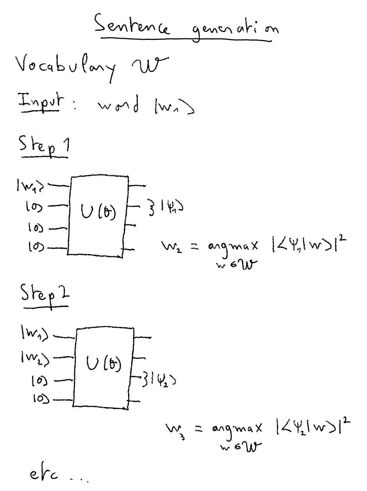

# Variational Language Model
**QHack hackathon | 22-26 february 2021**\
*By `TeamX` Slimane Thabet & Jonas Landman* 

## Introduction
In this project, we developed a variational quantum algorithm for **Natural Language Processing** (NLP). Our goal is to **train a quantum circuit such that it can process and recognize words**. Applications varies from **word matching**, **sentence completion**, **sentence generation**, **named entity recognition** and more.

---
#### Word encoding
Words are preprocessed using state-of-the art deep learning **word embedding** methods such as FastText. Then these embeddings arer cast down to few features using dimensionality reduction. For instance each word will be described as a vector of 8 dimensions. Using **Quantum Amplitude Encoding**, we can encode each word into a 3-qubits register. If a **sentence** is composed of $N$ words, and to represent it we propose to stack $N$ 3-qubits register sequentially.

#### Variational Circuit
We propose a new ansatz and training methodology to perform this NLP quantum learning:  
- The ansatz is composed of several layers of controlled rotations that mix the words between each other, and between themselves. 
- During the training, we will **mask one word randomly in each sentence**, by imposing its quantum register to  $|0\rangle$
- Using a **SWAP Test**, a supplementary word is then compared to the output register of the missing word (after the output of the ansatz). Therefore the cost function is the probability of output '0' on the swap test's ancillary qubit. We chose the supplementary word to be the missing word itself in order to drive the learning. 
- The goal of the training is to adjust the ansatz's parameters such that **the missing word is guessed**. 

#### Applications
With such a circuit trained, we can provide a new sentence with a missing word and compare it with all possible words in the "dictionary". We can generate artifical sentence by starting with only one word, or completing a sentence after its last words. 

#### Performances
We consider $M$ sentences of $N$ words, each one encoded as $Q$ qubits. 
- **Number of qubits required**: One quantum circuit corresponds to one sentence plus an extra word and an ancillary qubit, therefore $Q*(N+1)+1$ qubits. E.g for a 4 words sentence with 3 qubits per word, we require 16 qubits. For a 5 words sentence with 4 qubits per word, we require 25 qubits. 
- **Number of trainable parameters**: The number of trainable parameters in the ansatz is around $Q*(1+N/2)*L$, where $L$ is the number of layers, on average (it depends of the parity of the number of words, and number of qubits). E.g for a 4 words sentence with 3 qubits per word and 3 layers, we require 27 parameters.

We can use AWS SV1 for parallelizing the gradient during the training. But the computational cost remains high due to the number of sentences and the total number of words in the dictionary. 

#### Datasets
We propose 3 differents datasets to train and test our algorithm
- **IMDB Dataset** composed of 100 000 sentences and 12 words in total
- **Newsgroup Dataset** composed of 100 000 sentences and 12 words in total
- An **synthetic dataset** of 'dummy' sentences with small number of sentences and words, for performance limitation and grammatical simplicity

#### Code architecture
- The **Pennylane** variational ansatz are defined in `utils.py`
- The NLP preprocessing using FastText is made in `embeddings.ipynb` and generate readable file as `embeddings.npy`, `sentences.npy` etc.
- In `config.py` are defined the global configurations such as the number of words, of qubit per word, and the number of layers per ansatz.
- In this notebook, we train the quantum variational circuit and test applications

---